read函数：
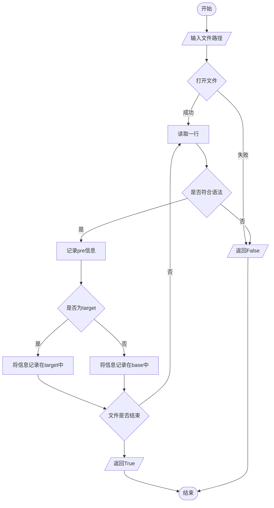
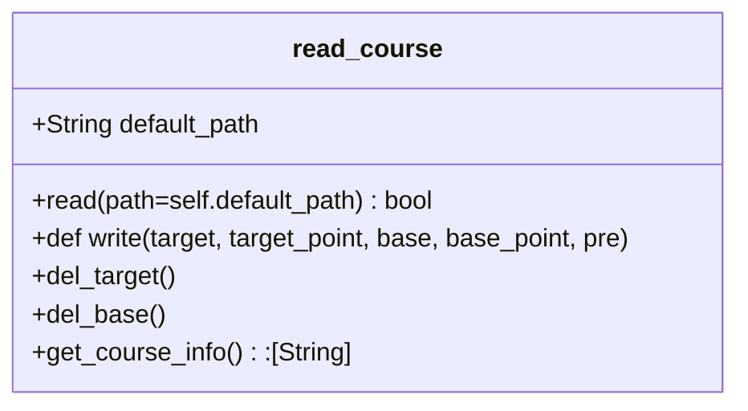
get_course_info()函数：
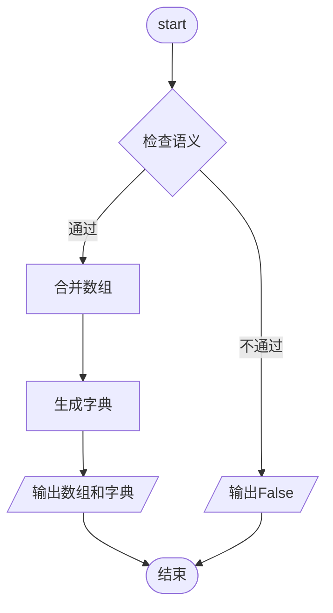
python mainwindow类UML：
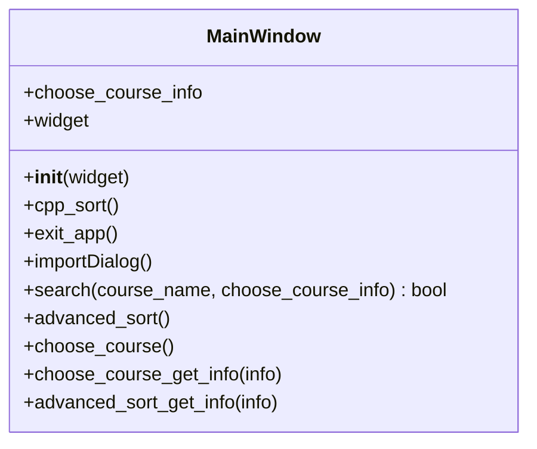

python OptionalCourse类UML：
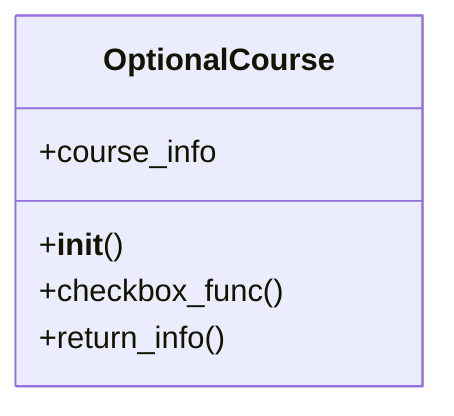
python ChangeCourse类UML：
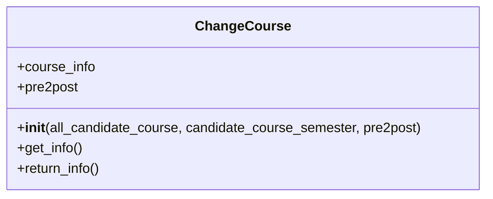
python ChangeCourse类get_info()流程图：
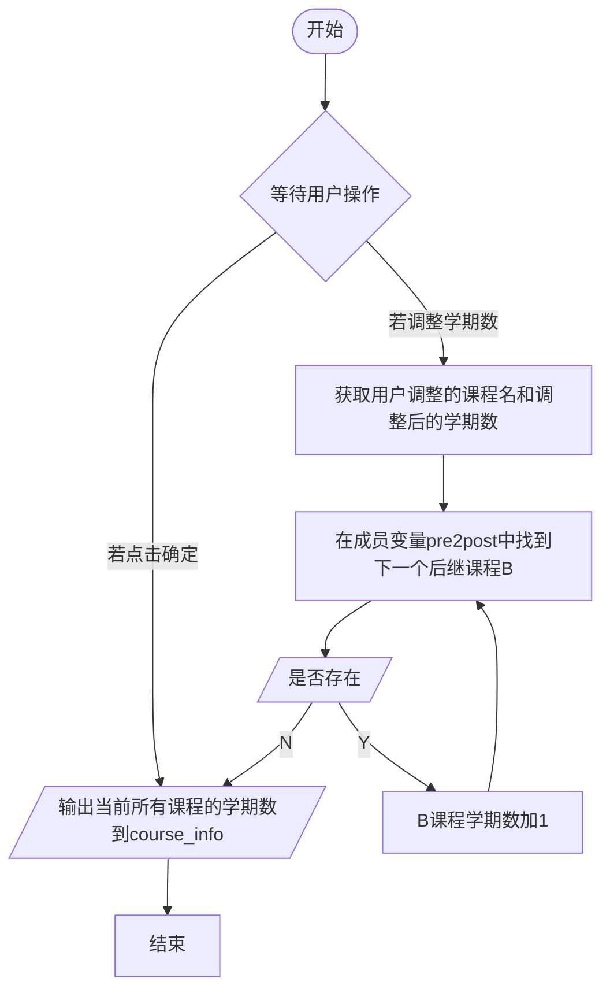
python widget类uml:
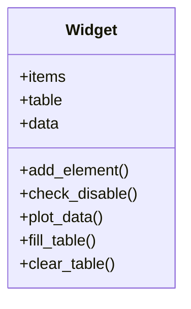
cxx course类uml：
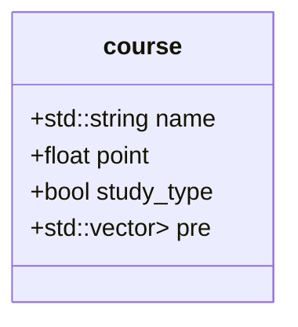
cxx schedule类uml:
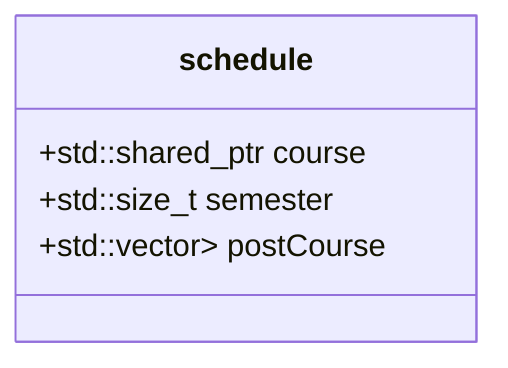
cxx 接口函数normal_sort_cxx 流程：
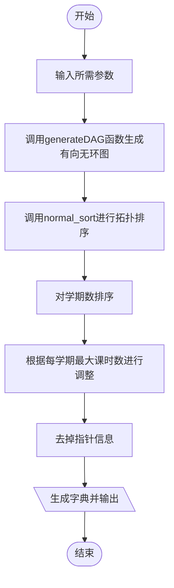
cxx接口函数pre2post_cxx流程：
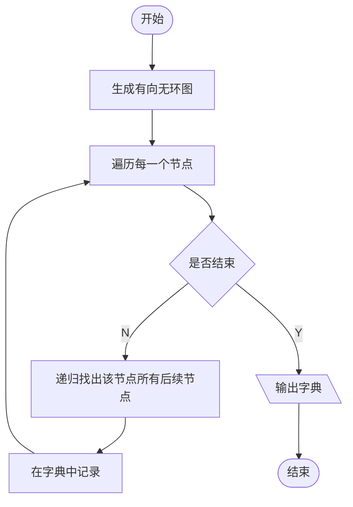
cxx排序函数generateDAG generate_target流程：
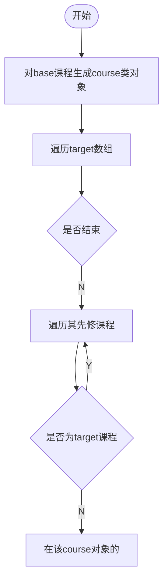